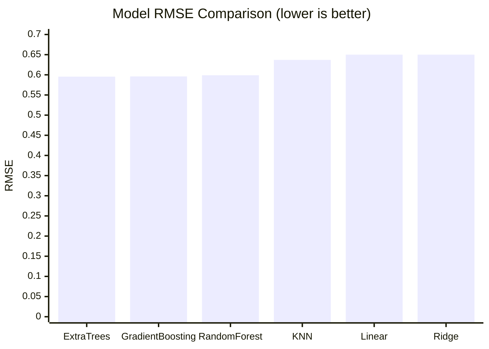

# Laser Power Model Comparison

## Overview

Six regression algorithms were tested to predict `laser_power` from the EEG-derived supporting features. All models used the same preprocessing and the same subject-held-out test split.

- Dataset: 29,515 observations from 223 subjects
- Target: `laser_power`
- Features: 27 numeric supporting features
- Split: 80% training / 20% testing, grouped by subject
- Missing values: median imputation
- Random seed: 42

## Results

Lower MAE and RMSE are better. Higher R2 is better.

| Rank | Model               |        MAE |       RMSE |         R2 |
| ---: | ------------------- | ---------: | ---------: | ---------: |
|    1 | Extra Trees         |     0.4480 | **0.5955** | **0.3315** |
|    2 | Gradient Boosting   |     0.4524 |     0.5960 |     0.3303 |
|    3 | Random Forest       | **0.4471** |     0.5989 |     0.3238 |
|    4 | K-Nearest Neighbors |     0.4926 |     0.6371 |     0.2349 |
|    5 | Linear Regression   |     0.5022 |     0.6500 |     0.2036 |
|    5 | Ridge Regression    |     0.5022 |     0.6500 |     0.2036 |

## Key Findings

- **Extra Trees performed best overall**, with the lowest RMSE and highest R2.
- **Gradient Boosting was nearly tied** with Extra Trees and may be a strong alternative with further tuning.
- **Random Forest had the lowest MAE**, meaning it made the smallest average absolute prediction error, although its RMSE and R2 were slightly weaker.
- The tree-based models outperformed the linear and nearest-neighbor models, suggesting that the relationship between EEG features and laser power is likely nonlinear.
- Linear Regression and Ridge Regression produced identical rounded results in this run, so regularization did not improve performance with the current feature set.

## Recommendation

Use **Extra Trees as the current baseline model** and compare any future improvements against its RMSE of `0.5955` and R2 of `0.3315`. Before making a final model choice, repeat the evaluation with grouped cross-validation across multiple subject splits so the ranking is not dependent on one test split.

## Model Files

- `01_linear_regression.py`
- `02_ridge_regression.py`
- `03_random_forest.py`
- `04_extra_trees.py`
- `05_gradient_boosting.py`
- `06_knn_regression.py`
