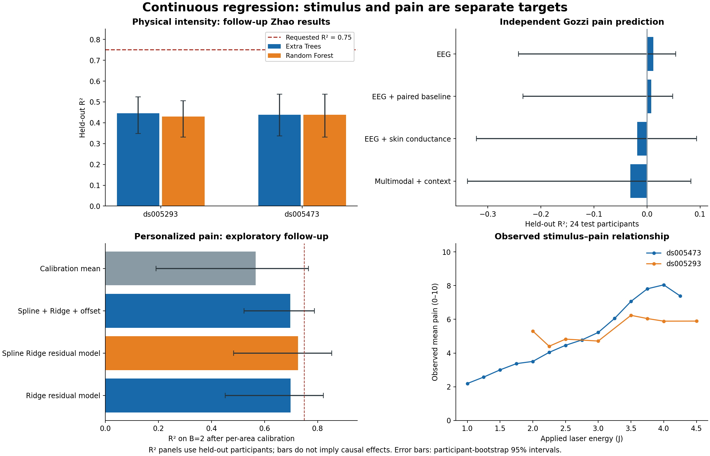

# Continuous stimulus and pain prediction from EEG

**Update: the uploaded independent Gozzi data have now been trained and evaluated, including an actual joint Zhao–Gozzi training experiment. The closest result is R² 0.726 for calibrated Gozzi pain prediction; the original physical-intensity task remains around R² 0.44.** All scores below are real executions, and R² is distinct from correlation or classification accuracy.

For the main **physical stimulus intensity** task, the expanded study-specific development search selects **Extra Trees and Random Forest** on both priority Zhao studies. Histogram gradient boosting remains a close alternative from the original pooled search. The new data support continuous **pain-rating** regression but contain no trial-level stimulus energy, temperature, or current; they cannot supply additional supervised physical-intensity targets. Do not substitute the binary `pain` marker, trial number, block, or NRS for physical intensity.

## New stimulus results and the 0.75 goal

18 configurations × 3 development folds × 2 studies = **108 additional fits**. The follow-up selects by development OOF RMSE to match the R² goal; the original analysis used equal-study/participant MAE. The best two distinct families were frozen before these follow-up test evaluations. The original Zhao test participants were already observed in the previous analysis, so these are **exploratory follow-up results, not fresh confirmatory validation**.

| Dataset | Development-selected family | Test R² [participant-bootstrap 95% CI] | MAE (J) | Test participants |
|---|---|---:|---:|---:|
| ds005293 | Extra Trees | 0.446 [0.348, 0.524] | 0.437 | 19 |
| ds005293 | Random Forest | 0.429 [0.331, 0.506] | 0.445 | 19 |
| ds005473 | Extra Trees | 0.438 [0.337, 0.538] | 0.602 | 6 |
| ds005473 | Random Forest | 0.439 [0.331, 0.538] | 0.600 | 6 |

The original ds005473 histogram boosting result was R² 0.439; the expanded search provides essentially similar performance, not a demonstrated breakthrough. Extra Trees' within-participant correlation on ds005473 is 0.730, but **that is r, not R² 0.75**. Six test participants also leave substantial uncertainty. No split was changed, test participant discarded, or metric relabeled to reach the requested number.

## Independent Gozzi pain results

The publisher's [release](https://zenodo.org/records/12570277) and [code](https://github.com/neuroenglab/multidimensional_pain) describe EEG/EDA features and NRS regression. The actual uploaded files match all three publisher MD5s. The release table contains **22,428 rows from 117 participants**, comprising **11,214 event/baseline pairs** across up to three areas and two blocks. This is broader than the publication summary of 4,697 trials; Area 1 alone contains exactly 4,697 event rows. We used all available areas and retained reported 0 ratings. This is an independent analysis of the release, not a reproduction of the paper's restricted cohort/area analysis.

`pain=1` rows are used as event observations; the paired `pain=0` rows provide baseline physiology. Both rows carry the event NRS, so baseline rows are **not** treated as extra independently labeled trials or assigned artificial zero ratings. Join keys are `id, Area, B, iTrial`, checked one-to-one. One duplicated physiological vector occurs at CRPP_128 trials 13/14; conservatively quarantine that entire participant (93 events), leaving **11,121 trials / 116 participants**. Source EEG windows, feature extraction and trial alignment were not rederived from waveforms.

**Split:** 8,901 development trials / 92 participants; 2,220 test trials / 24 participants. Stable hash split, all areas and blocks of a person stay together; 3 participant-separated development folds. Four feature views × 18 configurations × 3 folds = **216 additional CV fits** across Ridge, spline Ridge, RBF SVR, Extra Trees, Random Forest, histogram boosting and MLP. Preprocessing fits on training folds only; predictions are clipped to the known NRS range 0–10. Select on development OOF RMSE; all candidate metrics and convergence flags are retained. Each row below is one of the two best distinct families within its feature view by development performance, not a test-selected winner.

| Input features | Family | Test R² [95% CI] | MAE (0–10 NRS points) |
|---|---|---:|---:|
| EEG only | Ridge | 0.012 [-0.242, 0.054] | 2.243 |
| EEG only | MLP | 0.017 [-0.218, 0.054] | 2.233 |
| EEG + paired baseline | Spline + Ridge | 0.008 [-0.234, 0.049] | 2.247 |
| EEG + paired baseline | Ridge | 0.009 [-0.228, 0.051] | 2.244 |
| EEG + skin conductance + paired baselines | Spline + Ridge | -0.018 [-0.321, 0.093] | 2.269 |
| EEG + skin conductance + paired baselines | Ridge | -0.019 [-0.307, 0.078] | 2.263 |
| Multimodal + basic context | Ridge | -0.031 [-0.339, 0.083] | 2.269 |
| Multimodal + basic context | Spline + Ridge | -0.032 [-0.368, 0.099] | 2.277 |

The development-mean baseline has test R² **-0.017**, MAE **2.283**. Negative R² means worse than predicting the test-set mean; it is a valid failure result.

**The two overall Gozzi finalists**, selected by development error across feature views while requiring distinct model families, are **Spline + Ridge (EEG + skin conductance + paired baselines)**, **Ridge (EEG + skin conductance + paired baselines)**. Their saved models were fitted only on development participants. They require their respective sensors/context and are not EEG-only models unless explicitly labeled as such.

Feature definitions: 13 event EEG features plus 5 relative band powers (18); add paired baseline features and event-minus-baseline transformed differences for 49 EEG features; all EEG/skin-conductance features and their paired baselines/differences give 169; add age, coded gender, BMI, four cohort indicators and three area indicators for 179. Positive EEG features use log transforms; signed features use signed-log transforms; skin-conductance amplitude/derivative quantities have a fixed 10⁶ scaling before the signed log. All model clipping/imputation/scaling parameters remain train-only. In these uncalibrated feature views, IDs, NRS, baseline NRS, trial index, block and `pain` marker are excluded. The later calibration-aware experiment explicitly adds statistics of earlier calibration ratings. The subject-area file validates joins and is included unchanged; its QST/CPM/temporal-summation outcomes are not treated as trial stimulus labels or supplied as predictors. Basic context does not include other self-reported pain scores.

### Personalization: a different deployment setting

For each held-out participant and area, reserve the first 10 retained trials in block B=1 (at least 5 required) for calibration; score **only B=2**, never the calibration trials. Block ordering is a chronology proxy, not verified timestamps. Choose residual-offset vs affine correction and regularization strength 1/5/20/100 using development OOF predictions only. The same test subjects are unseen during global model fitting but provide these calibration ratings. A calibration-rating-mean baseline and the uncalibrated model on exactly the same evaluated rows are included.

| Selected model | B=2 trials / participants | Uncalibrated R² | Calibrated R² | Calibration-mean baseline R² | Calibrated MAE |
|---|---:|---:|---:|---:|---:|
| multimodal/spline_ridge | 1103 / 24 | -0.012 | 0.696 | 0.566 | 1.036 |
| multimodal/ridge | 1103 / 24 | -0.008 | 0.693 | 0.566 | 1.039 |

### Calibration-aware follow-up: R² 0.726

After the first test evaluation, we ran one targeted **exploratory follow-up on the same test participants**. This is not a new untouched validation cohort. Instead of fitting absolute pain first and then adjusting its offset, these models learn block-B=2 pain minus the earlier per-area calibration mean. Inputs are the 169 multimodal features, their differences from per-area calibration feature means, and the calibration rating mean and standard deviation (340 total). The only rating-derived predictors come from the first up-to-10 B=1 trials per area, with at least 5 valid calibration trials required. Every B=2 rating is excluded from constructing predictors. Participant-separated development CV still selects the families and settings.

Six configurations (three Ridge strengths, one spline model and two histogram-boosting settings), three folds: **18 more CV fits**. The two selected families are below. They score the same **1,103 B=2 trials from 24 participants** as the previous calibration comparison.

| Model | Development OOF R² | Test R² [participant-bootstrap 95% CI] | Test MAE (NRS points) |
|---|---:|---:|---:|
| Spline + Ridge residual model | 0.594 | 0.726 [0.483, 0.853] | 0.871 |
| Ridge residual model | 0.594 | 0.698 [0.452, 0.822] | 0.969 |

The calibration-mean baseline is R² 0.566; the earlier spline-plus-offset model is 0.696. The follow-up's R² **0.726** is close to the requested numerical target, but it is **personalized multimodal pain prediction, not EEG-only physical-intensity decoding**. Uncertainty is broad; the highest score needs confirmation on new participants/sessions before treating it as a stable improvement. The two residual models are included alongside the original uncalibrated finalists in the same fitted model bundle.

### Did combining the datasets help?

We actually fitted joint models, not just added files to a folder. Both sources contribute pain labels in 0–10 units and centered log ratios of five EEG band powers. Each source has equal total training weight. Ridge (three strengths) and Extra Trees were selected by 3-fold target-development CV, with only source-development participants available for augmentation. Target-only and joint conditions use the same target test participants. **48 additional CV fits.** The exact channel, band boundaries and extraction windows have not been harmonized, so this is an approximate feature-alignment experiment, not validated physiological equivalence or a frozen external transfer claim.

| Target data | Target-only R² | Joint Zhao + Gozzi R² |
|---|---:|---:|
| Gozzi | -0.017 | -0.186 |
| Zhao | 0.103 | 0.040 |

The tested pooling strategy worsened both targets; keep source-specific models for now. This does not rule out transfer after matched raw-EEG extraction, but these results do not justify claiming a benefit from adding this source. Together the new experiments comprise **426 additional CV fits, including 18 calibration-aware follow-up and 36 dose-prediction fits**, beyond the original 120, plus finalist/test fits.

### What would make 0.75 a defensible goal?

For single-trial EEG → physical intensity on unseen people, 0.75 remains an unmet target with these features. More model search alone is not supported as a reliable route by the present results. The next useful data are matched raw EEG with numeric stimulus levels and repeated sessions (the Tiemann internal cohort below), so preprocessing can preserve spatiotemporal information and a genuinely new cohort can test the model. Personalized calibration or averaging repeated responses changes the deployment task and must have its own evaluation; neither may be presented as an improvement in uncalibrated single-trial prediction.

## Predicting pain from known stimulus energy

This supplementary experiment answers the forward stimulus→pain question directly. It uses **laser energy only**, not EEG, and is distinct from decoding unknown stimulus intensity. Six configurations (three Ridge strengths, two spline models, one monotonic histogram-boosting model), three development folds and two studies add **36 CV fits**. The two families per study and optional calibration configuration are selected from development predictions. Optional calibration uses the first 10 retained labeled epochs per test person; only later epochs are scored. Epoch order is an unverified chronology proxy, and the Zhao test participants were already viewed previously.

| Study | Family | Later-trial R² without calibration | Later-trial R² with calibration [95% CI] | Calibrated MAE (NRS) |
|---|---|---:|---:|---:|
| ds005293 | Histogram gradient boosting | 0.066 | 0.121 [0.008, 0.208] | 1.863 |
| ds005293 | Spline + Ridge | 0.066 | 0.113 [-0.005, 0.203] | 1.869 |
| ds005473 | Histogram gradient boosting | 0.409 | 0.597 [0.351, 0.734] | 1.162 |
| ds005473 | Spline + Ridge | 0.409 | 0.601 [0.359, 0.737] | 1.163 |

The dense-dose ds005473 models reach about **R² 0.60 after calibration**, versus about 0.41 on the same later trials without calibration. This supports useful person-specific dose-response prediction, but does not establish R² 0.75, and must not be reported as EEG→stimulus performance.

## Original Zhao benchmark (retained for comparison)

## Practical recommendation

- In the original pooled benchmark, **Extra Trees** ranked first and **histogram gradient boosting** second. Fit and evaluate them separately for each acquisition/stimulus protocol before considering pooled training.
- For the specific question of an increasing stimulus, prioritize **ds005473** within Zhao: 12–15 energies per person. **ds005293** adds 95 participants with four energies per person. Two-energy studies are useful secondary tests; one-energy-per-person studies cannot estimate a within-person stimulus slope.
- Acquire **Tiemann/Bott's internal repeated-session laser cohort** next for independent physical-intensity validation. **Gozzi/Preatoni** has now been analyzed above. Hamburg is a promising continuous-time extension, but its public access was not confirmed. Details and direct sources are below.
- Do not describe the current system as a general pain meter. Brain-only pain prediction is modest, and the pooled models do not establish a reliable improvement over a study-mean baseline under the equal-study metric.

## What is being predicted?

| Question | Predictors | Target | Interpretation |
|---|---|---|---|
| EEG → stimulus | EEG features only | `laser_power`, interpreted as laser **energy in joules**, despite the column name | Primary regression task; real-valued output, no intensity binning |
| EEG → pain | EEG features only | `rating`, expected 0–10 | Secondary regression task; subjective pain differs from applied stimulus |
| Stimulus → pain | Recorded stimulus and pain pairs | Within-person pain change per joule | Descriptive dose-response association, not an EEG model or causal estimate |
| EEG + known stimulus → pain | EEG and actual applied energy | Pain rating | Supplementary experiment when stimulus settings are available at inference |

A regression model can output any real value even when a protocol contains a few discrete stimulus levels. That alone does not prove interpolation to untrained energies, extrapolation, or tracking of continuously varying heat.

## Most useful study-specific held-out results

These supplemental fits use only development participants from the named study, retaining the same held-out participants and the globally selected hyperparameters. They are actual executions, but not independently tuned study-specific champions or independent external validation.

| Study | Model | Test participants / trials | MAE (J) | RMSE (J) | R² | Equal-participant MAE, 95% CI |
|---|---|---:|---:|---:|---:|---|
| ds005293 | Extra Trees | 19 / 1435 | 0.438 | 0.538 | 0.444 | 0.446, [0.382, 0.519] |
| ds005293 | Histogram gradient boosting | 19 / 1435 | 0.446 | 0.544 | 0.430 | 0.454, [0.391, 0.524] |
| ds005473 | Extra Trees | 6 / 795 | 0.607 | 0.740 | 0.433 | 0.601, [0.523, 0.675] |
| ds005473 | Histogram gradient boosting | 6 / 795 | 0.601 | 0.736 | 0.439 | 0.595, [0.512, 0.669] |

The held-out ds005473 test contains only six participants, so do not treat small model differences as a stable leaderboard. The study-specific result supports further work; cross-study transfer remains poor.

## Primary, pooled benchmark

**Selection metric:** average absolute error within each participant, then average participants within each study, then average studies equally. This prevents a large study or a participant with many trials from deciding the ranking. Models themselves are trained with equal weight per trial. Conventional pooled MAE/RMSE/R² are also reported and can tell a different story.

Twenty configurations per target, three participant-separated development folds: **120 cross-validation fits**, followed by fitting the two selected families per target on all development data and scoring the reserved test participants. Hyperparameters and family ranks were selected before those primary test scores were inspected. The equal-weight blend is a fixed supplementary comparison, not another tuned winner.

### Stimulus intensity

Development: 20,700 trials / 411 participant groups. Test: 5,246 trials / 104 groups. Error units: J.

| Model | Pooled MAE | RMSE | R² | Within-person r | Equal-study/participant MAE [95% CI] |
|---|---:|---:|---:|---:|---|
| Training study-mean baseline | 0.482 | 0.623 | 0.229 | undefined (constant) | 0.487 [0.444, 0.534] |
| Extra Trees | 0.466 | 0.618 | 0.240 | 0.567 | 0.481 [0.432, 0.545] |
| Histogram gradient boosting | 0.470 | 0.621 | 0.233 | 0.555 | 0.485 [0.435, 0.550] |
| Equal-weight finalist blend | 0.468 | 0.619 | 0.238 | 0.564 | 0.482 [0.432, 0.547] |

Development ranking (best configuration per family; lower is better):

| Rank | Family | Cross-validated macro MAE | Parameters |
|---:|---|---:|---|
| 1 | Extra Trees | 0.500 | `{"min_samples_leaf": 50, "max_features": 1.0}` |
| 2 | Histogram gradient boosting | 0.502 | `{"max_leaf_nodes": 7, "l2_regularization": 10, "max_iter": 200}` |
| 3 | Random forest | 0.503 | `{"min_samples_leaf": 40, "max_features": 1.0}` |
| 4 | RBF support-vector regression | 0.503 | `{"C": 1, "gamma": 0.01}` |
| 5 | MLP neural network | 0.504 | `{"hidden_layer_sizes": [64, 32], "alpha": 1.0}` |
| 6 | Spline + ridge | 0.505 | `{"n_knots": 3, "alpha": 100}` |
| 7 | Ridge | 0.505 | `{"alpha": 100}` |

### Reported pain

Development: 22,611 trials / 538 participant groups. Test: 5,757 trials / 137 groups. Error units: 0–10 rating points.

| Model | Pooled MAE | RMSE | R² | Within-person r | Equal-study/participant MAE [95% CI] |
|---|---:|---:|---:|---:|---|
| Training study-mean baseline | 1.913 | 2.319 | 0.074 | undefined (constant) | 1.821 [1.713, 1.922] |
| Spline + ridge | 1.813 | 2.228 | 0.146 | 0.443 | 1.834 [1.699, 1.961] |
| Extra Trees | 1.801 | 2.216 | 0.155 | 0.449 | 1.820 [1.687, 1.945] |
| Equal-weight finalist blend | 1.805 | 2.219 | 0.152 | 0.452 | 1.825 [1.692, 1.952] |

Development ranking (best configuration per family; lower is better):

| Rank | Family | Cross-validated macro MAE | Parameters |
|---:|---|---:|---|
| 1 | Spline + ridge | 1.769 | `{"n_knots": 3, "alpha": 100}` |
| 2 | Extra Trees | 1.770 | `{"min_samples_leaf": 50, "max_features": 1.0}` |
| 3 | MLP neural network | 1.773 | `{"hidden_layer_sizes": [32], "alpha": 10.0}` |
| 4 | Histogram gradient boosting | 1.774 | `{"max_leaf_nodes": 7, "l2_regularization": 10, "max_iter": 200}` |
| 5 | Ridge | 1.776 | `{"alpha": 100}` |
| 6 | Random forest | 1.778 | `{"min_samples_leaf": 40, "max_features": 1.0}` |
| 7 | RBF support-vector regression | 1.804 | `{"C": 1, "gamma": 0.01}` |

The first-ranked pain family on development data was **spline + ridge**, followed by **Extra Trees**. Extra Trees scored better on the reserved test, but the development ranking is preserved rather than retrospectively declaring a new selected winner. The main two-model recommendation concerns **stimulus intensity**, not every possible target.

### Why the pooled R² alone is misleading

The stimulus study-mean baseline already has pooled R² of 0.229, despite having no EEG input and making no within-person changes. This reflects different energy distributions between studies. Extra Trees reaches 0.240, but its equal-study MAE improvement over that baseline is only 0.0063 J; the paired participant-bootstrap 95% interval for model-minus-baseline MAE is **[-0.0444, +0.0329] J**, which includes no improvement. For pain, the corresponding Extra Trees interval is **[-0.0895, +0.0887] rating points**. These are not convincing all-study improvements.

| Study | Stimulus baseline R² | Pooled Extra Trees R² | Pooled boosting R² | Study-specific Extra Trees R² | Study-specific boosting R² |
|---|---:|---:|---:|---:|---:|
| ds005280 | -0.001 | -0.719 | -0.727 | 0.014 | -0.018 |
| ds005285 | -0.337 | -0.696 | -0.734 | -0.337 | -0.473 |
| ds005292 | -0.019 | -0.972 | -1.033 | 0.016 | -0.023 |
| ds005293 | -0.001 | 0.404 | 0.395 | 0.444 | 0.430 |
| ds005473 | -0.008 | -0.048 | -0.046 | 0.433 | 0.439 |

R² below zero means predictions are worse in squared error than the constant mean of that test subset. That mathematical reference is distinct from the deployable baseline, which uses only the training study mean. Per-study performance shows why a pooled score cannot establish portability.



## Does pain rise with stimulus intensity?

Within each participant, subtract their mean stimulus and mean rating, then estimate a common study slope from the centered observations:

`beta = sum((energy - person_mean_energy) * (rating - person_mean_rating)) / sum((energy - person_mean_energy)**2)`

This removes stable between-person intercept differences. It is a linear association over each study's observed dose range. Participants with greater within-person stimulus variance and more trials contribute more to the slope. Uncertainty resamples participants, not individual trials.

| Study | Participants with dose variation | Rating points per joule | Participant-bootstrap 95% CI | Fraction with positive individual slope |
|---|---:|---:|---|---:|
| ds005280 | 220 | 3.135 | [2.889, 3.366] | 98.6% |
| ds005285 | 29 | 3.546 | [2.943, 4.191] | 100.0% |
| ds005292 | 142 | 2.161 | [1.915, 2.413] | 94.4% |
| ds005293 | 95 | 0.911 | [0.820, 1.005] | 98.9% |
| ds005473 | 29 | 1.973 | [1.816, 2.127] | 100.0% |

For ds005473 the estimated slope is **1.97 points/J**, with all 29 individual slopes positive. The finding is descriptive: it does not establish a universal law, forecast an individual's response, or justify extrapolating beyond the recorded range. The plotted curves use participant averages at each energy; the set of participants can vary between energies, so a curve can dip even when within-person slopes are positive. Zero pain ratings are retained as potentially real observations, not reclassified or removed.

## Generalization and additional checks

### Study transfer

Fit on development participants from all other Zhao studies, then predict the reserved participants in the target study. Model family/parameters come from the original development search, which included target-study development data. Therefore this is an **exploratory source-only refit**, not a fully nested leave-one-study-out evaluation and not non-Zhao external validation.

| Target study | Extra Trees transfer R² | Boosting transfer R² |
|---|---:|---:|
| ds005280 | -1.209 | -1.198 |
| ds005285 | -1.455 | -1.741 |
| ds005292 | -1.599 | -1.698 |
| ds005293 | 0.340 | 0.327 |
| ds005473 | -0.292 | -0.292 |

The failure on several target studies is a material limitation. A source-specific model working in its own study does not establish cross-protocol performance.

### Withheld energies plus unseen participants

In ds005473, remove **1.50, 2.25, 3.00 and 3.75 J** from the final fitting data and evaluate those energies in the reserved participants. The final fit uses 1,997 trials; testing uses 237 trials from six participants. Preprocessing is refitted on that restricted training data. Initial global hyperparameter selection did see these levels in development data, so this is an interpolation diagnostic, not an entirely unseen-energy model-selection experiment.

| Model | MAE (J) | RMSE (J) | R² | Within-person r |
|---|---:|---:|---:|---:|
| Extra Trees | 0.554 | 0.679 | 0.343 | 0.700 |
| Histogram gradient boosting | 0.535 | 0.671 | 0.357 | 0.707 |

### Pain prediction with known stimulus

Same reserved participants, same selected parameters, supplementary fits. The stimulus-only baseline is essential when asking whether EEG adds information beyond the physical stimulus.

| Model | Inputs | MAE (rating points) | R² |
|---|---|---:|---:|
| Spline + ridge | stimulus only | 1.861 | 0.102 |
| Spline + ridge | eeg plus stimulus | 1.777 | 0.171 |
| Extra Trees | stimulus only | 1.816 | 0.132 |
| Extra Trees | eeg plus stimulus | 1.732 | 0.206 |

### Five-trial personal calibration

Reserve the first five retained, labeled trials of each test participant for calibration only; evaluate later retained trials. Apply a fixed half-strength rating offset: `0.5 * mean(calibration_rating - model_prediction)`. This corresponds to five calibration observations and five prior pseudo-observations. It was not tuned on evaluation ratings. Retained epoch order is only a chronology proxy because source session/run provenance is absent.

Evaluation includes 5,072 trials from 137 participants. The appropriate uncalibrated comparison uses exactly those same later trials, not the full test set.

| Model / setting | MAE | R² | Equal-study/participant MAE |
|---|---:|---:|---:|
| Calibration-rating mean only | 1.828 | 0.086 | 1.649 |
| Spline + ridge — uncalibrated | 1.836 | 0.148 | 1.852 |
| Spline + ridge — with calibration | 1.640 | 0.301 | 1.591 |
| Extra Trees — uncalibrated | 1.824 | 0.157 | 1.839 |
| Extra Trees — with calibration | 1.635 | 0.304 | 1.598 |

This improvement concerns **personalized** prediction after observing five ratings. It is not brain-only prediction for a completely uncalibrated person. An offset cannot improve within-person correlation; its benefit is adjusting the person's rating baseline.

## Data audit and study selection

The supplied table has **29,515 trials, 32 columns and 678 study/subject IDs**. Raw source rows remain unchanged in `data/zhao_features.csv`. The loader applies exclusions in memory:

- **76 rows have duplicated EEG feature vectors.** All 30 trials of ds005280/sub-035 and sub-036 have matching EEG features and labels across the two IDs. Sub-108 contains eight repeated feature pairs, some with contradictory intensity or rating labels. Quarantine all three subjects: **84 rows removed**, leaving **29,431 rows and 675 groups**. The original waveforms must resolve whether this originated in data duplication or extraction; this audit does not assign fault to the source study.
- **1,061 ratings are missing**. Two more ratings, 18 and 34, are inconsistent with the expected 0–10 scale: ds005291/sub-027/epoch 9 and ds005292/sub-129/epoch 28. Exclude these target values pending provenance verification. Do not clip them to 10 or invent corrections. They can remain in the separate stimulus task.
- The stimulus benchmark uses the **five studies with within-person energy variation**: 25,946 rows / 515 groups after quarantine. Pain prediction uses all nine: **28,368 labeled rows / 675 groups**.
- `plv_FCz-CPz` is missing in approximately 84.75% of source rows and is omitted from the predictor schema. Acquisition metadata, study/subject IDs, epoch number and both targets are excluded from EEG predictors. The remaining **23 EEG features** produce **seven additional fixed spectral features** (five relative powers and two log ratios).
- Alpha/beta ERD contain large extremes, so signed-log mapping and training-only 0.5th/99.5th percentile clipping are used. No test data contribute to imputation, scaling, clipping bounds, spline knots or target normalization.

| Study | Source trials | Subject IDs | Energy levels per person | Source energy range (J) | Role |
|---|---:|---:|---:|---|---|
| ds005280 | 6,275 | 223 | 2 | 3–4 | Stimulus + pain |
| ds005284 | 348 | 26 | 1 | 2.75–4.5 | Pain only; no within-person dose variation |
| ds005285 | 4,618 | 29 | 2 | 2–4.5 | Stimulus + pain |
| ds005286 | 880 | 30 | 1 | 2.25–4.5 | Pain only; no within-person dose variation |
| ds005289 | 372 | 39 | 1 | 2.75–4.5 | Pain only; no within-person dose variation |
| ds005291 | 1,885 | 65 | 1 | 3–4.5 | Pain only; no within-person dose variation |
| ds005292 | 4,153 | 142 | 2 | 3–4 | Stimulus + pain |
| ds005293 | 7,291 | 95 | 4 | 2–4.5 | Stimulus + pain |
| ds005473 | 3,693 | 29 | 12–15 | 1–4.5 | Stimulus + pain |

Numbers in this table describe the supplied CSV, not a claim that raw source files were reprocessed. The paper's broad description and a specific extracted table can differ; confirm energies against derivative metadata before a publication.

### Evaluation safeguards and limitations

1. Group identity is `dataset/subject`, avoiding collisions between repeated `sub-001` names in different datasets. No group appears in both development and test. All trials/sessions represented by that ID stay together. Unrecorded cross-study participant overlap cannot be ruled out from this CSV alone.
2. A deterministic SHA-256 ordering of participant IDs, seed `20260924`, reserves `ceil(20%)` of subjects per study. Remaining IDs are assigned to three development folds. Splits never depend on outcomes, feature values or trial counts.
3. Each model receives the same EEG feature definitions. All fitted preprocessing is inside its fold. MLP internal random-row early stopping is disabled; iteration/convergence flags are preserved. The finite 20-configuration search is not exhaustive or proof that every family was optimally tuned.
4. Target standardization is training-only and inverted before scoring. Predictions are continuous and not rounded to known stimulus levels. Test targets are used only for evaluation, except the explicitly separated calibration scenario.
5. Confidence intervals resample participants within studies, keeping each participant's trials together. They quantify test-subject sampling variation conditional on the fitted model; they do not include model-training uncertainty. Within-person correlation uses centering for the evaluation metric only, never as access to test targets for prediction.
6. This is an audit and benchmark of supplied features. Raw EEG quality, label-to-epoch alignment, reference/channel mapping, artifact rejection and whether source preprocessing used future samples remain unverified. Exact duplicate checks do not rule out near duplicates or less obvious alignment errors.
7. EEG features are post-stimulus summaries, approximately extending to 0.6 s according to the supplied extractor. These results do not establish pre-stimulus prediction, streaming operation, clinical pain monitoring or real-world deployment.
8. Existing repository result tables use different feature sets, splits and sometimes additional information. Their numbers are not presented as controlled comparators or used to select this run's winners.

## External datasets: suitability review, not fabricated benchmark results

**External status updated:** Gozzi is now supplied, verified, trained and evaluated above. Other reviewed sources remain unacquired; the table distinguishes publication descriptions from inspected files. Zhao's nine experiments remain related source studies, not independent non-Zhao validation.

The remaining first acquisition priority is **Tiemann/Bott/Ploner's internal repeated-session cohort** for closely matched laser intensity and pain prediction. **Gozzi/Preatoni et al.** now provides the independent pain-rating experiment above. These are priorities based on design, not measured model superiority.

| Dataset / primary source | What it adds | Decision for this project |
|---|---|---|
| [Tiemann, Bott et al., 2026](https://journals.plos.org/plosbiology/article?id=10.1371/journal.pbio.3003948); [EEG-BIDS data](https://osf.io/z2h86/); [analysis/derived data](https://osf.io/bs3yj/) | Internal cohort of 161 healthy participants, two sessions approximately four weeks apart, four laser energies, 0–100 pain ratings. | **First independent phasic EEG dataset to acquire.** Use all suitable intensity levels for this task; the paper's main analysis selects higher intensities and removes stimulus effects, which is a different question. Group both sessions of a person together. Inspect the separately supplied 111-person replication cohort for overlap with Zhao before treating it as independent. |
| [Gozzi/Preatoni et al., 2024, Zenodo](https://zenodo.org/records/12570277); [author code](https://github.com/neuroenglab/multidimensional_pain) | 118 participants: 37 healthy and 81 across CRPS, low-back pain and spinal-cord-injury neuropathic pain cohorts; 4,697 experimentally induced pain trials; EEG and EDA. The release has Trials.pkl, Subjects.csv and SubjectAreas.csv. | **Best compact next download for independent pain regression.** Trial features are about 10.5 MB. The authors' code includes numerical pain-rating regression. Confirm trial-level target, EEG-only columns, baseline markers and physical-intensity units from actual files before adaptation. Do not assume the same feature definitions as Zhao. |
| [Hamburg Fluctuating Pain Database](https://github.com/visserle/HamburgFluctuatingPainDatabase) | 45 healthy adults; fluctuating tonic heat, EEG and continuous behavioral/physiological records, approximately 27 hours / 8 GB. | **Strongest conceptual match for continuously changing stimulation over time**, contingent on access. At review time the README still says the public downloader is not ready and refers to a private Figshare link. The merged Feature_Data table explicitly excludes EEG; the EEG table must be joined correctly. No claim of a usable public download here. |
| [Roy et al. / OpenNeuro ds006897](https://github.com/OpenNeuroDatasets/ds006897); [author analysis](https://github.com/mpcoll/2025_painrvs) | Independent EEG from 41 participants in an experimental pain and rhythmic visual stimulation study. | Secondary external stress test. Inspect stimulus/rating time series and intervention annotations before defining regression labels; visual entrainment can change EEG independently of pain. Schema and continuous-target suitability not yet verified from files. |
| [Han, Valentini & Halder, 2026](https://onlinelibrary.wiley.com/doi/pdf/10.1002/ejp.70313); [EEG data](https://osf.io/2mqtb/files/osfstorage) | 36 analyzed participants; thermal pain, warm and resting conditions, 62-channel EEG. | Useful tonic-state/domain-shift comparison, lower priority for stimulus dose regression. Published analysis is primarily classification; the reported VAS concerns unpleasantness. Do not relabel unpleasantness as pain intensity or hot/warm classes as a dense continuous dose. |
| [Mulders et al., pain_TSL_EEG](https://github.com/dmulders/pain_TSL_EEG) | Independent pain-learning experiment with EEG and behavioral data linked from the authors' repository to OSF. | Worth acquisition for expectation-related generalization. Verify label meaning, timing and stimulus levels before inclusion; prediction/expectation ratings are not interchangeable with experienced pain. |
| [Alhajri et al., capsaicin connectivity data](https://data.mendeley.com/datasets/d3jkkbpcmf/4) | 28 participants, capsaicin/placebo and eyes-open/closed conditions; connectivity measures and pain summaries. | Small supplementary association dataset. Not a dense physical-stimulus regression dataset; repeated conditions must remain within person-level splits. |
| [WearableEEG-ChronicPain-FeatureData](https://github.com/inachenyx/WearableEEG-ChronicPain-FeatureData) | 20 chronic-pain participants, dual-channel EEG, 960 segments with 78 features. | Exclude from the primary continuous benchmark: the release describes severity **class labels**. Do not turn mild/moderate/severe into invented continuous pain values. |
| [BioVid Heat Pain Database](https://www.nit.ovgu.de/en/BioVid.html) | Heat-pain video and peripheral physiology; research-access agreement required. | Exclude from EEG-only benchmarking: the official page explicitly says EEG is unavailable. It can support a separate multimodal project. |
| [X-ITE Pain Database](https://www.nit.ovgu.de/nit/en/AI%2Bresearch%2Binfrastructure%2B_%2Bresearch%2Bdatabases/International%2Bresearch%2Bdatabases/XITE%2BPain.html) | 134 participants with thermal/electrical pain, video/audio, EDA, ECG and EMG at three intensities. | Exclude from EEG-only comparisons: listed modalities do not include EEG. The few calibrated levels also do not demonstrate dense continuous-dose generalization. |
| [PainMonit](https://figshare.com/articles/dataset/The_PainMonit_Database_An_Experimental_and_Clinical_Physiological_Signal_Dataset_for_Automated_Pain_Recognition/26965159) | Public experimental heat/clinical physiotherapy physiological dataset under CC BY 4.0. | Candidate for a separate physiological-sensor benchmark; not accepted as an EEG regression dataset without verified EEG channels and synchronized continuous targets. |

The repository's separate PhysioNet motor/imagery analysis is not a pain-intensity dataset. Adding it to the labeled pain benchmark would not satisfy independent validation of this target.

### How to add external data without mixing incompatible experiments

1. Acquire the two priority sources and inspect the actual files. Keep source licenses and participant identifiers. The included `download-gozzi` command uses the publisher's file MD5s and fails explicitly if download or verification fails.
2. Build one trial/window table per source with explicitly named numeric EEG features, subject ID, target and units. The Gozzi adapter now implements its inspected schema with verified release checksums. The generic `external` command accepts that audited CSV and runs the same seven-family selection and held-out-subject protocol.
3. First benchmark each source independently. Shared model families can be compared even if feature schemas differ. This **does not** establish cross-dataset model transfer.
4. To test frozen-model transfer, extract the same channels, referencing, epoch windows, feature formulas and units from both datasets. Fit normalization on training sources only. Never concatenate joules and degrees Celsius into one physical target. A known 0–100 to 0–10 rating conversion is possible, but does not make rating anchors and modalities equivalent.
5. For continuous time series, use non-overlapping windows, synchronize actual delivered temperature and rating timestamps, and choose any physiological/rating lag on training data only. Keep all windows from a participant together; use blocked later-session evaluation for personalized models. Exclude rating motor responses and future samples from predictors.
6. Re-run selection on development data and reserve a genuinely untouched external test set. External MAE, RMSE, R², within-person correlation, participant-bootstrap uncertainty and failure cases determine the final recommendation.

### Broader model choices

The seven executed families test linear, additive nonlinear, kernel, randomized-tree, bagged-tree, boosting and neural-network models on the available feature table. They do not establish the globally best possible model.

- **CatBoost and modern tabular foundation models** are credible additional candidates. [TabPFN-3's technical report](https://arxiv.org/abs/2605.13986) reports strong general tabular benchmarks, but that is not evidence of superiority on this EEG task. Required packages/checkpoints could not be acquired here. No scores are assigned to unrun models.
- **Raw EEG temporal/spatial networks** require waveform data and matched preprocessing. A compact convolutional/temporal model with separate continuous stimulus and pain heads is a reasonable experiment; it should compete against the tabular finalists on identical participant splits. Applying a temporal convolution across an arbitrary list of scalar features is not a raw-EEG temporal model.
- **Personalized models** address a different use case. A few calibration trials can estimate a person's rating offset, but their evaluation labels must not enter that estimate. Full-subject target centering before the split would reveal held-out labels.
- A monotonic stimulus→pain fit can describe a conditional dose relationship. Imposing that same monotonic relationship on EEG→pain would be an unsupported restriction. Adaptation, expectations, subject sensitivity and measurement noise all matter.

## Files and reproducibility

| File | Purpose |
|---|---|
| `model.py` | Models, fold-safe preprocessing, audits, benchmark, transfer/local fits, dose analysis, figure generation, external CSV interface and downloader |
| `data/zhao_features.csv` | Unmodified copy of the supplied `Aditya/Feature Extraction/features_combined.csv` |
| `requirements.txt` | Exact tested dependency versions; Python 3.12 used |
| `results.json` | Original and new candidate scores, selected parameters, test metrics, uncertainty, audits and hashes; new keys: `gozzi`, `joint`, `stimulus_refined`, `dose_predict`, `personalized` |
| `data/gozzi/Trials.pkl`, `Subjects.csv`, `SubjectAreas.csv` | Three checksum-identical publisher files |
| `external_predictions.csv.gz` | New Gozzi, joint-training and refined stimulus predictions, identified by `experiment` |
| `gozzi_models.joblib` | Two uncalibrated and two personalized Gozzi finalists, trained only on development participants, with feature lists and calibration configurations |
| `predictions.csv.gz` | Primary held-out predictions with original zero-based source-row identity, study, subject, epoch and task |
| `stress_predictions.csv.gz` | Source-only and study-specific prediction rows; enough to recompute those comparisons |
| `results.png` | One results figure |
| `README.md` | This report |

Thirteen deliverable files: the original eight plus the three unchanged Gozzi source files, one combined follow-up predictions file and one fitted Gozzi model bundle (two uncalibrated plus two personalized finalists). No copied repository, notebooks or CV caches are packaged. The model code can also fit stimulus inference artifacts on demand. The original unseen-energy and EEG-plus-known-stimulus ablations remain available as metrics and reproducible code; their individual predictions are not separately exported. New dose-prediction trials are included in the follow-up predictions file.

### Reproduce from scratch

From this directory, with Python 3.12 and normal package-download access:

```bash
python -m venv .venv
# macOS/Linux:
source .venv/bin/activate
# Windows PowerShell instead: .venv\Scripts\Activate.ps1
python -m pip install -r requirements.txt
python model.py self-check
python model.py benchmark --out rerun --jobs 3
python model.py stress --out rerun --jobs 3
python model.py summarize --out rerun
```

`benchmark` caches completed candidate configurations in its output directory. Use a new output directory after changing the feature schema, code, hyperparameter grid or selection policy. Do not tune future models against the now-visible test results; reserve new participants or an independent external dataset.

### Fit either selected stimulus model for inference

Example: use the dense-dose ds005473 data and the second selected family, histogram gradient boosting:

```bash
python model.py fit --task stimulus --rank 2 --dataset ds005473 --save stimulus_ds005473.joblib
python model.py predict --model stimulus_ds005473.joblib --csv new_trials.csv --save predictions.csv
```

For Extra Trees use `--rank 1`; for ds005293 change the dataset argument. Omitting `--dataset` fits the pooled selected model, whose limitations are shown above. The saved model refits all available rows in the selected scope, including former test participants. It is an inference artifact and must never be used to recreate the reported held-out evaluation. New rows must use the same feature definitions, channels, preprocessing and units. Load only trusted joblib artifacts.

### External data

```bash
python model.py download-gozzi
```

The uploaded source files are already included under `data/gozzi/`; no download is needed. The adapter refuses an unexpected MD5 before loading the publisher pickle. Do not load arbitrary untrusted pickles/joblib files.

Reproduce new experiments (allow CPU time; use a new output directory after any code/grid change):

```bash
python model.py gozzi --out rerun --jobs 3
python model.py stimulus-refine --out rerun --jobs 2
python model.py joint --out rerun --jobs 2
python model.py dose-predict --out rerun --jobs 2
python model.py personalized --out rerun --jobs 3
python model.py consolidate --out rerun
```

Run the original benchmark/stress/summarize commands first if you want `rerun/results.json` to include original Zhao results too. The commands cache only within the chosen run directory; delivered results contain no caches.

Use the new study-specific stimulus ranking:

```bash
python model.py fit-refined --dataset ds005473 --rank 1 --save stimulus.joblib
python model.py predict --model stimulus.joblib --csv new_trials.csv --save stimulus_predictions.csv
```

Rank 1 is Extra Trees, rank 2 Random Forest on both priority studies. `fit-refined` refits all available study rows, including former test rows, for inference only.

Prepare verified Gozzi features and run the delivered development-only finalists:

```bash
python model.py prepare-gozzi --save gozzi_features.csv
python model.py predict-gozzi --model gozzi_models.joblib --csv gozzi_features.csv --save gozzi_predicted.csv
```

For the new calibration-aware models, use:

```bash
python model.py predict-personalized --model gozzi_models.joblib --csv gozzi_features.csv --save personalized_predictions.csv
```

Provide the per-person/per-area B=1 calibration rows with their ratings and B=2 rows to predict; B=2 `NRS` may be missing and never affects the predictions. This command outputs B=2 predictions only. New-subject features must be extracted identically to the publisher schema. The standard `predict-gozzi` command produces predictions on all supplied rows, including training rows; only rows with `split=test` can reproduce the uncalibrated held-out metrics. For new recordings, generate the identical feature schema; the checksum-gated import command specifically handles the supplied publisher release. Calibration analysis is implemented in `calibrate_predictions`, and the chosen configuration is stored with each saved model. `predict-gozzi` returns uncalibrated predictions and does not silently consume pain labels.

After building an audited numeric trial CSV, the interface is:

```bash
python model.py external --csv data/external_trials.csv --subject participant_id --target pain_rating --features eeg_feature_1,eeg_feature_2 --name independent_study --source SOURCE_DOI_OR_URL --units rating_points --target-min 0 --target-max 10 --out external_results
```

The names in this example are schema placeholders, **not** asserted Gozzi column names. Pass the actual verified EEG feature list and target range. Include `--dataset-col` only for a harmonized table whose cohorts have the same target units/semantics; repeated visits of a person must share a group. This command retrains/evaluates models within the independent dataset; it is not a frozen Zhao→external transfer test.

### Verification completed

The run checked participant isolation, prohibited predictor fields, out-of-range label handling, training-only transform state, and finite fit/predict output for all seven model families. Actual full-data fits completed. Stored primary predictions can be joined to the unmodified CSV by `source_row`, and stored transfer/local predictions retain the same key. The figure was visually inspected. The new independent runs additionally verified one-to-one event/baseline and subject joins, participant split separation, prohibited predictors, held-out prediction/metric agreement, saved-model inference, and invariance of calibration predictions to changing B=2 evaluation ratings.

## Provenance

[Zhao et al., A comprehensive EEG dataset of laser-evoked potentials for pain research](https://www.nature.com/articles/s41597-025-05900-1), Scientific Data (2025), DOI 10.1038/s41597-025-05900-1. Data accessions are listed above. Cite the source studies and follow each source's terms; this package makes no new claim about rights to external data.

The supplied archive identifies repository revision `e5436776d63a2ccb1448383e4a4c502c1a24a0db`. Source feature CSV SHA-256:

`911bde42916a67c170ab60b04e333a6fbb9362dd435e2c28a9e1f98e326a924c`
