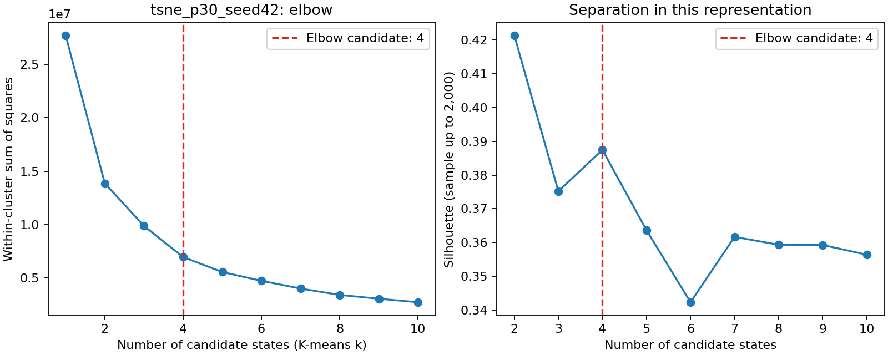
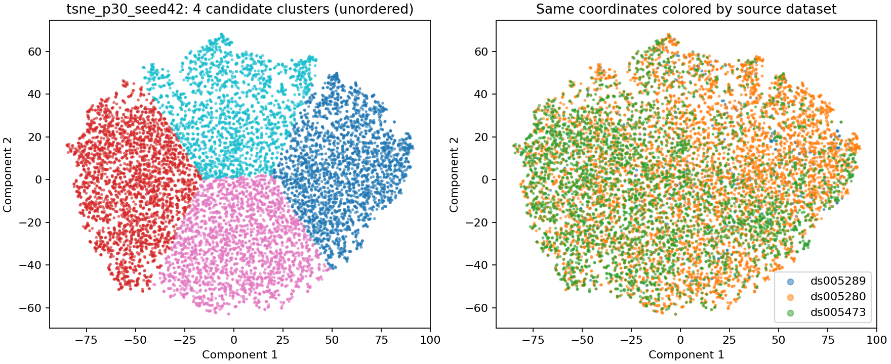

# Initial state discovery results

The elbow suggests **3-4 candidate EEG clusters**, depending on the representation. This run does not establish an optimal number of pain states. The silhouette criterion favors two clusters in all five representations, so the selection criteria disagree.

## Data and settings

Source: `Aditya/Feature Extraction/features_combined.csv`, restricted to the three requested datasets before any fitting.

| Dataset | Epochs | Dataset-specific subjects |
| --- | ---: | ---: |
| ds005280 | 6,275 | 223 |
| ds005289 | 372 | 39 |
| ds005473 | 3,693 | 29 |
| Total | 10,340 | 291 |

The model uses the existing 24-feature EEG allowlist, with outcomes and identifiers excluded. `plv_FCz-CPz` is entirely missing and contributes no information. No epochs were dropped. Two missing ratings in ds005289 were retained for clustering. After median imputation and standardization, PCA retained 15 components explaining 95.89% of variance. t-SNE used these components as input and ran for 1,000 iterations. Every K-means sweep used k=1 through 10 and 20 initializations per k.

## Candidate cluster counts

| Representation | Elbow candidate | Silhouette at candidate |
| --- | ---: | ---: |
| PCA | 3 | 0.154 |
| t-SNE, perplexity 30, seed 42 | 4 | 0.387 |
| t-SNE, perplexity 30, seed 7 | 4 | 0.387 |
| t-SNE, perplexity 50, seed 42 | 3 | 0.388 |
| t-SNE, perplexity 50, seed 7 | 3 | 0.371 |

Silhouette values across these different spaces are not directly comparable evidence of pain-state validity. The t-SNE plot looks like a connected cloud partitioned by K-means, rather than clearly isolated islands.

At perplexity 30, seed-to-seed assignment stability is high: adjusted Rand index (ARI) = 0.974. At perplexity 50, both seeds select three clusters, but assignment stability is lower: ARI = 0.483. Relative to the first perplexity-30 run, the perplexity-50 assignments have ARI 0.398 and 0.532. A stable cluster count therefore does not imply stable membership.

Dataset adjusted mutual information is low (0.022-0.030), which indicates little agreement between cluster labels and dataset identity under this metric; it does not rule out acquisition confounds. Within-dataset rating summaries show substantial overlap. For example, PCA cluster rating medians in ds005289 are 6.02, 6.05, and 6.04 despite more distinct profiles in the other studies. Cluster IDs are unordered and are not named low, moderate, or high pain.

## KNN transfer

KNN needs labels, so it was trained to reproduce training-only PCA/K-means cluster assignments. Imputation, scaling, PCA, elbow selection, and clustering were refitted separately inside every training fold. The elbow selected three clusters in all eight folds.

| Evaluation | Mean KNN agreement with K-means | Training-majority baseline |
| --- | ---: | ---: |
| Five subject-held-out folds | 94.71% | 42.86% |
| Three dataset-held-out folds | 93.37% | 36.37% |

These are unweighted means over folds. Dataset-held-out agreement is 92.67% for ds005280, 91.67% for ds005289, and 95.78% for ds005473. This is **pseudo-label agreement, not pain prediction accuracy**: both the KNN and reference assignments come from EEG-derived models, without independent pain-state ground truth. KNN transfer was evaluated in PCA coordinates; no separately fitted test t-SNE embedding was used.

## What to try next

Use the PCA three-cluster result as an initial reproducible reference and keep the two- and four-cluster alternatives under consideration. Confirm rating definitions across studies, then evaluate whether the candidate states have consistent rating associations on unseen subjects. Compare PCA + Gaussian mixtures if soft membership is useful, and check participant/study balancing and sensitivity to the elbow search range before fixing a state count.

Four automated checks passed. Output validation confirmed 10,340 unique source rows in each of five assignment tables, only the requested datasets, one prediction per epoch per evaluation scheme, and no subject split across test folds within a scheme. Ten plots and fold-specific metrics are saved in [state_discovery_results](state_discovery_results/). Settings, source fingerprint, and metrics are in [summary.json](state_discovery_results/summary.json); installed package versions are in [environment.txt](state_discovery_results/environment.txt).

See [the methodology and run instructions](STATE_DISCOVERY.md) for interpretation limits and primary-source references.
